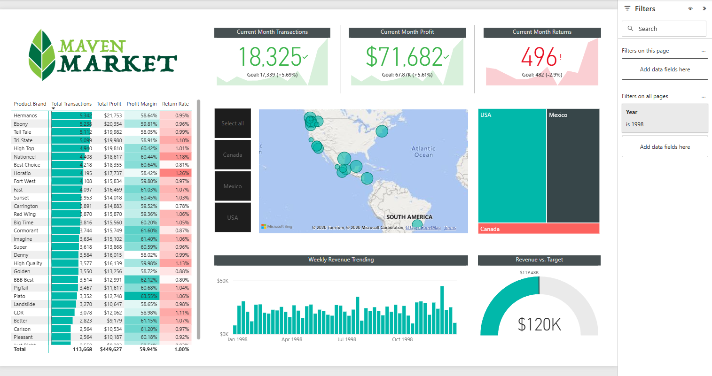

# 📊 Maven Market Sales Performance Dashboard

An interactive Business Intelligence dashboard built using Power BI to analyze sales performance, product profitability, and regional revenue distribution for Maven Market.

This project demonstrates practical data analysis, KPI monitoring, and data visualization skills commonly required for Data Analyst roles.

## 📷 Dashboard Preview



## 🧠 Business Problem

Retail companies generate large volumes of transactional data, but without proper visualization it becomes difficult to answer important business questions such as:

* Are sales meeting monthly targets?

* Which product brands generate the most profit?

* Which regions contribute the most revenue?

* Are product return rates affecting profitability?

This dashboard transforms raw transactional data into clear, actionable insights to support data-driven decision making.

## 🎯 Project Objectives

The goal of this project is to build a dashboard that enables stakeholders to:

* Monitor key sales KPIs

* Evaluate product brand performance

* Identify high-performing regions

* Track revenue trends over time

* Compare actual performance vs business targets
`````````````````````````````````````````````````````````````````
## 📊 Key Performance Indicators (KPIs)

| KPI                        | Description                             | Value   |
| -------------------------- | --------------------------------------- | ------- |
| Current Month Transactions | Total transactions in the current month | 18,325  |
| Current Month Profit       | Total profit generated this month       | $71,682 |
| Current Month Returns      | Number of returned products             | 476     |
| Revenue vs Target          | Performance compared to sales target    | $120K   |

These KPIs allow decision makers to quickly evaluate overall business performance.

```````````````````````````````````````````````````````````````````
## 📈 Dashboard Components

# 1️⃣ KPI Cards

Displays high-level business metrics:

* Total transactions

* Monthly profit

* Product returns

Each KPI includes target comparison, enabling quick performance evaluation.

# 2️⃣ Product Brand Analysis

A detailed table showing performance of each product brand including:

* Total transactions

* Total profit

* Profit margin

* Return rate

This analysis helps identify:

* Top-performing brands

* Brands with high return rates

* Products with strong profit margins

# 3️⃣ Geographic Sales Distribution

A map visualization displays sales distribution across regions:

* USA

* Mexico

* Canada

This allows stakeholders to identify regional sales performance and potential growth areas.

# 4️⃣ Weekly Revenue Trend

A bar chart showing revenue fluctuations across the year.

This helps identify:

* Seasonal sales patterns

* High revenue weeks

* Potential business cycles

# 5️⃣ Revenue vs Target

A gauge chart compares total revenue against the business target, providing a quick visual indicator of whether sales goals are being met.

## 💡 Key Business Insights

Based on the dashboard analysis:

* The USA contributes the highest share of revenue compared to other regions.

* Several product brands show strong profit margins but moderate return rates.

* Weekly revenue trends show fluctuations that may indicate seasonal demand patterns.

* Monitoring return rates is important because high returns can negatively impact profit margins.

## 🎛 Interactive Features

The dashboard includes interactive elements such as:

* Year filter

* Country selection

* Cross-filtering between visuals

These features allow users to explore the data dynamically and generate insights quickly.

## 🛠 Tools & Technologies

This project uses the following tools:

* Data Visualization

* Microsoft Power BI

* Data Analysis

* DAX (Data Analysis Expressions)

* Data Modeling

* Relationship modeling between tables

* Business Intelligence

* KPI monitoring

* Performance tracking

* Trend analysis
``````````````````````````````````````
## 📂 Repository Structure
maven-market-sales-dashboard
│
├── dashboard
│   └── Maven_Market_Dashboard.pbix
│
├── dataset
│   └── maven_market_dataset.csv
│
├── images
│   └── dashboard.png
│
└── README.md
````````````````````````````````````````
```````````````````````````````````````
## 🚀 How to Use

Clone this repository

git clone https://github.com/zRILLL28/Maven-Market-Sales-Performance-Dashboard.git

Open the .pbix file using Power BI Desktop

Interact with filters and visualizations to explore the data.
````````````````````````````````````````
## 📚 Skills Demonstrated

This project highlights several core skills expected from a Data Analyst:

* Data Visualization

* Dashboard Design

* Business KPI Analysis

* Data Exploration

* Data Modeling in Power BI

* Analytical Thinking

* Business Insight Generation
